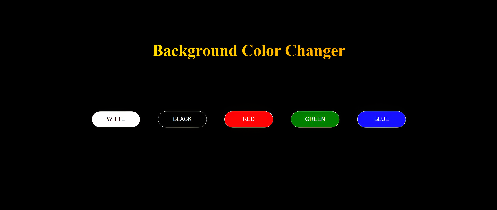

# Background Color Changer 🎨

An interactive web application that allows users to change the background color of the page with the click of a button. Built using **HTML**, **CSS**, and **JavaScript**, this project demonstrates event handling and dynamic styling.

---

## Features 🚀

- **Change Background Color:** Choose from predefined colors (White, Black, Red, Green, Blue) to change the page's background instantly.
- **Smooth Transitions:** Enjoy a visually appealing transition effect when the background color changes.
- **Responsive Design:** Optimized for all screen sizes with a mobile-friendly layout.
- **Hover Effects:** Buttons have a subtle hover effect for a modern UI experience.

---

## Preview 👀



---

## How to Use 📋

1. Clone this repository:
   ```bash
   git clone https://github.com/Tamilselvan6/daily-javascript-tasks.git
   ```
2. Navigate to the project folder:
   ```bash
   cd background-color-changer
   ```
3. Open `index.html` in your browser to run the app.

---

## Technologies Used 🛠️

- **HTML:** For the basic structure of the app.
- **CSS:** For styling and layout, including hover effects and responsive design.
- **JavaScript:** For dynamic background color changes and event handling.

---

## Future Enhancements ✨

- Add more color options with a color picker.
- Implement gradient backgrounds and allow users to customize them.
- Include a "Reset" button to revert to the default background color.

---

## License 📜

This project is open-source and available under the MIT License.
